Neural networks are powerful tools used for Artificial Intelligence and Machine Learning. They can enable computers to make decisions that appear intelligent. They are able to do this by simplifying apparently complex patterns to identify their underlying mathematical simplicity.

We will create neural networks that solve simple problems that involve classifying data points. The reason we use  simple problems here is to reveal the logic that governs how neural networks work (without needing any maths!)

### Using Tensorflow Playground

We are going to be using an easy-to-use educational visualisation called [Tensorflow Playground](https://playground.scienxlab.org/). The version we are using is a fork of the [original](https://playground.tensorflow.org/).

#### Task:

1. Open up a web browser and visit [https://playground.scienxlab.org/](https://playground.scienxlab.org/)

#### !

><Column>

#### Task:

2. Get familiar with the interface - don't worry you can't break it!

#### !

* **Hidden layers**: Use the +/- to add or remove hidden layers 
* **Neurons per layer**: Use the +/- to add or remove neurons from a layer 
* **Green play button**: Start training the network, you can watch the output change on the right showing you what the network has learned 
* **Reset button**: Forget the training to start training the same network again

><Column>

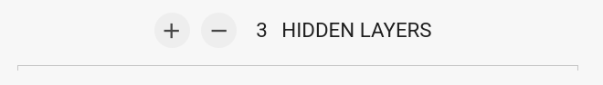

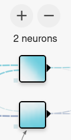

></>

#### Task:

3. Start training the network by pressing the green 'play' button

#### !

Once you've started training, the network will be learning where to draw the white line which divides the areas of blue and purple. It is trying to get the blue dots to be in the blue section, and the purple dots to be in the purple section. Whether it succeeds depends on factors that we will explore below.

You can reset the network, adjust the network settings by adding or removing neurons and hidden layers, and try again.

><Column>

4. A few more things to be aware of that we will use later on:

* The "Features" on the left of the network are the inputs to our network. We can choose which inputs to use 
* The icons on the left change the data we are using (the positions of the dots). If you are interested, there is more information about the data and how to use your own data below
* The options at the top of the page can be left as the default; these control how the network learns. If you are interested, there will be more information below

><Column>

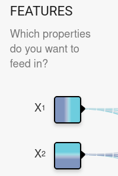

></>

If at any time you want to reset everything back to the defaults, just close the tab and open [https://playground.scienxlab.org/](https://playground.scienxlab.org/) again

---

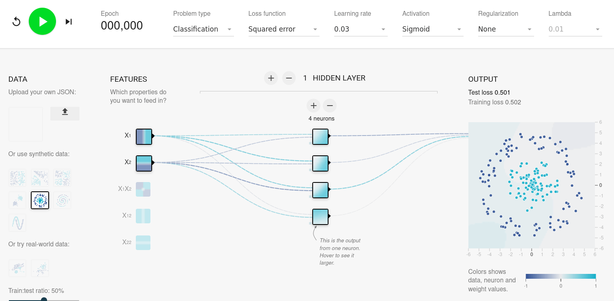

---

Tensorflow Playground lets us train simple neural networks

* Choose the data to use
* Design the network by adding layers and neurons
* It visualises the output of each neuron during training

### One Feature

Let's get started by training the simplest network we can imagine. We are going to train a network that learns to classify - or draw a line between - two sets of data. At first, this data will be very simple. We can apply the same principles to work with much more complicated data.

#### Task: Set up the Network

1. Select "Linear" Data 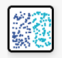; Find this on the left side of the screen under the 'Data' heading, just below where it says 'Or use synthetic data:'
2. Remove all hidden layers, so it shows "0 Hidden layers"
3. Select only the X_1 Feature

#### !

Your network should look like this (note this is before training):

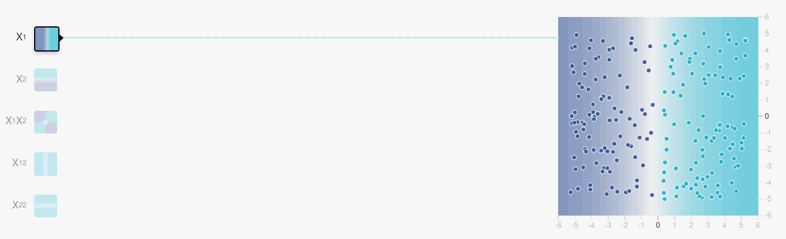

#### Task: Training

4. Train the network. Where does it learn to draw a line dividing the data points?

#### !

<KeyPoint>
A classifier is a neural network for categorising data. (The final layer of) a classifier is trying to draw a straight line through the data. In this case, data to the left of the line is the 'purple' data, and data to the right is 'blue' data.
</KeyPoint>

---

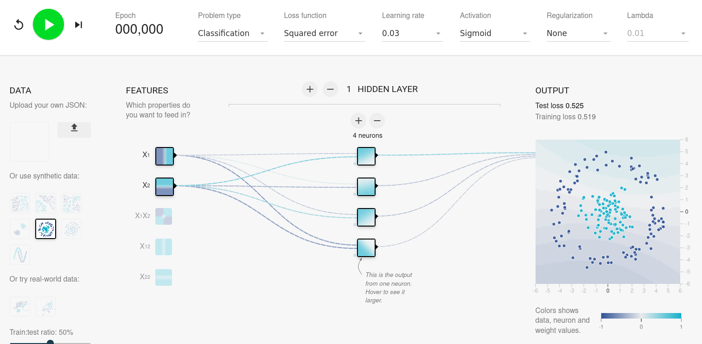

### One Feature - Limitations

We have a simple neural network that uses only one feature (X_1). It can classify our "linear" data set. We want to discover what the limits of this network are.

#### Task: Evaluation

5. See how the network you created above behaves on data that follows a different pattern. Try the "Diagonal" data 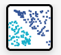

#### !

In this example, our network is trying to learn to classify the data based only on the x position of each dot.

<KeyPoint>
Neural networks can only learn patterns that exist in the data we provide. In the Diagonal example, we did not supply information about the y position of dots, so it has no way to use this information.
</KeyPoint>

---

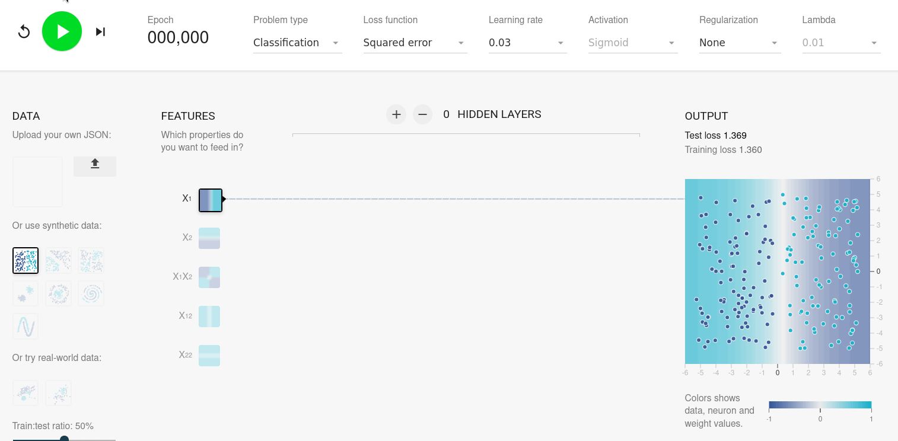

### Two Features

Now let's see how supplying the right features to our network gives it the information it needs. This information will allow it to learn to draw the line in the correct place. In other words, it will have correctly learned to classify the data.

#### Task: Set up the network

1. Once again, select Diagonal data  and create a network with 0 hidden layers; but this time, select both X_1 and X_2 features.

#### !

Your network should look like this (note this is before training):

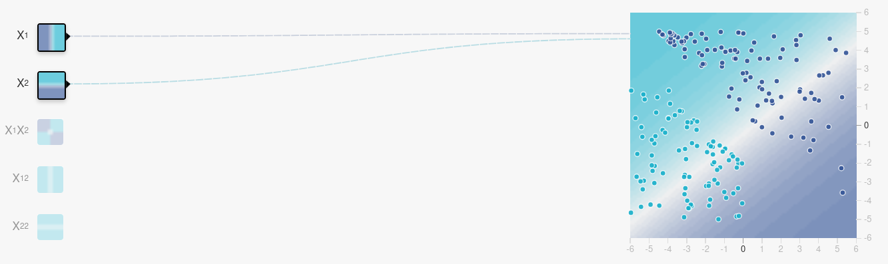

#### Task: Training

2. Train the network; see the output transform

#### !

What do we see here? By including `x` an `y` information in our output, the network has learned to draw a straight line across the 2D pattern of dots. In other words, it has learned to classify (or predict) whether a dot in the diagonal data set should be blue or purple based on its x and y position. 

---

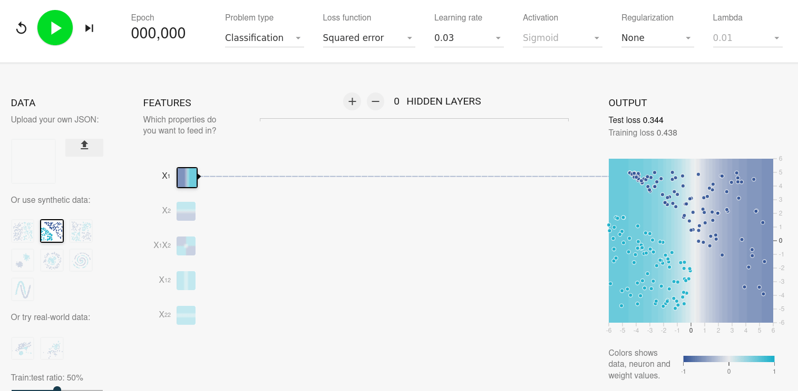

### Two Features - Evaluation

This network can learn to classify the linear and diagonal data very accurately. What other kinds of data can it accurately classify? Are there any kinds of data it cannot classify?

#### Task: Evaluation

><Column>

3. Test the other data sets provided. Find out which ones can be learned by this network, and which ones the network is unable to learn 

><Column>

></>

#### Aside: Evaluating Accuracy

To evaluate a network, we can look at its "Training loss"; this is the error between what the network predicts and the correct answer. We want this to drop to a very small number,

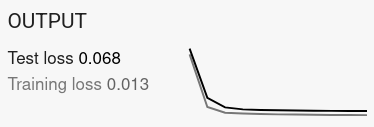

#### !

<KeyPoint>
Providing input features that encode the necessary information makes it possible for the right neural network to learn a function (pattern), meaning the training loss (error) decreases. However, not all designs of neural network can learn all functions; in these cases the training loss (error) remains high.
</KeyPoint>

---

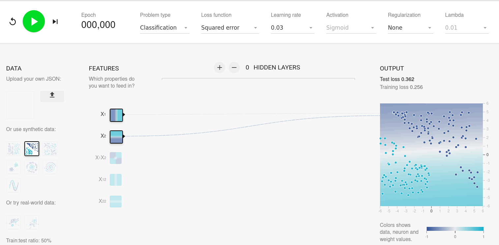

### Hidden Layers

Now we are going to learn how adding hidden layers can make our network more intelligent.

* Each layer of neurons is connected to the previous layer.
* The data is goes in at the left of the network and is passed from layer to layer.

<KeyPoint>
Each layer of neurons transforms the values it receives from previous layers by squashing and stretching (but never splitting or breaking) them. We might say that each layer produces a different 'representation' of the underlying data.
</KeyPoint>

Let's see this in action with a more complex data set.

#### Task: Set up the network

1. Select "Circle" data.

2. Add a hidden layer to your network, so you have 1 hidden layer. This hidden layer should contain 2 neurons.

#### !

Your network should look like the following (before training):

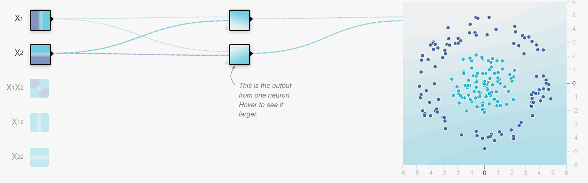

#### Task: Training

3. Train your network. What happens? 

#### !

While better than our previous network, because our new network can draw a curving line, for some reason it can never learn to draw a circle. Next we will learn why this is.

<KeyPoint>
Adding hidden layers allows the network to divide the data using a more curvy line (or 'hyperplane').
</KeyPoint>

---

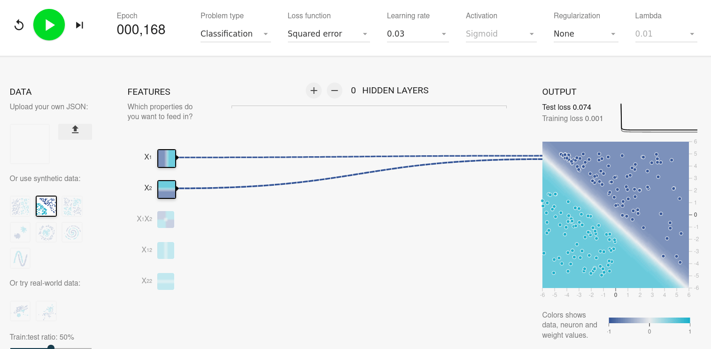

### Transforming the Data

Let's see what is happening here.

Our neural network is trying to draw a line to separate the blue and purple data. Like before, a layer (the final, output layer) can only draw a straight line. However, in this case, we have added a hidden layer that transforms (squashes and stretches) the data before passing it to the final layer. This means that - _from the perspective of the input data_ - the line that is drawn appears curved.

<KeyPoint>
Each hidden layer transforms the values it receives. While the 'line' it draws is always straight relative to the data it receives, relative to the original data, the line can be curved.
</KeyPoint>

Observe that this network is still not able to accurately classify the circle data. While it draws a curve, it can never succeed at drawing a circle, because there is no way to transform a circle in two dimensions to separate the inside and outside with a straight line.

---

><Column>

Hidden layers let the network squash and stretch the data to make it easier to separate with a straight line

This animation by [Chris Olah (2014)](https://colah.github.io/posts/2014-03-NN-Manifolds-Topology/) shows an example of this

><Column>

></>

<KeyPoint>
Deep networks contain many hidden layers
</KeyPoint>

---

><Column>

Our current network cannot possibly squash and stretch the circle to separate the two colours with a straight line.

This animation by [Chris Olah (2014)](https://colah.github.io/posts/2014-03-NN-Manifolds-Topology/) shows what our current network is trying to do.

><Column>

></>

### Moving to three dimensions

Let's take our network to another dimension in order to classify the "Circle" data set.

#### Task: Create the network

1. Add one neuron to your hidden layer. You should now have one hidden layer with three neurons, two input features (X_1 and X_2), and be using the circle data.

#### !

Your network should look like this, before training:

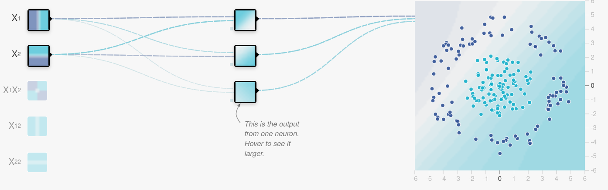

#### Task: Training

2. Train your network. Keep watching. It might take up to ten seconds or so.

#### !

What has happened?

The line has become a circle and the data is accurately classified. We could not do this in two dimensions above but now our hidden layer has three dimensions. Here is the confusing bit: What we have done is project the data from two dimensions into three dimensions where we can squash out the middle. 

The problem could not be solved in two dimensions, but could be solved in three.

---

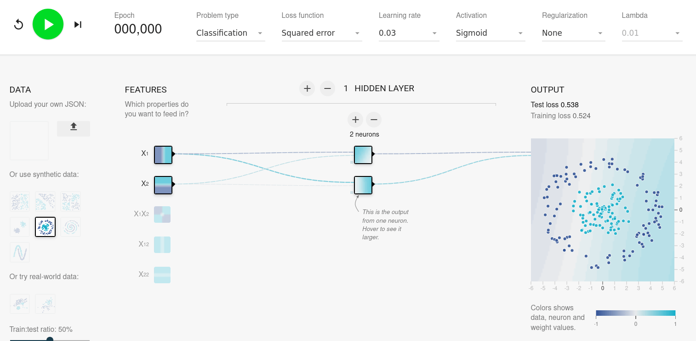

---

><Column>

This diagram by [Chris Olah (2014)](https://colah.github.io/posts/2014-03-NN-Manifolds-Topology/) shows how the network learns to squash out the middle of our circle in 3D

><Column>

></>

<KeyPoint>
In three or more dimensions we separate the data by drawing a 'hyperplane'
</KeyPoint>

### Summary

We can create a neural network and choose the features that we provide as its input. When we train the neural network, we show it examples. For each example, it receives the features we select as the input. It learns to classify these examples by drawing a line between them.

Simple networks can only perform simple tasks, but we can make networks more complicated by adding hidden layers, and adding more neurons to these hidden layers.

By adding hidden layers, the network can transform the data over more steps. Each layer squashes and stretches the input is receives. More layers means more complicated transformations. However, networks with more layers take longer to train.

By adding neurons to hidden layers we change the number of dimensions the data is represented in.

---

A neural network can learn to classify data

* The input must contain the information we want to learn
* The larger the network, the more complex patterns it can learn.

<KeyPoint>
Containing up to billions of neurons, modern neural networks can learn incredibly sophisticated patterns
</KeyPoint>

### Next Step

Now you've completed the demo, move on to the [practical](../../practicals/playground)