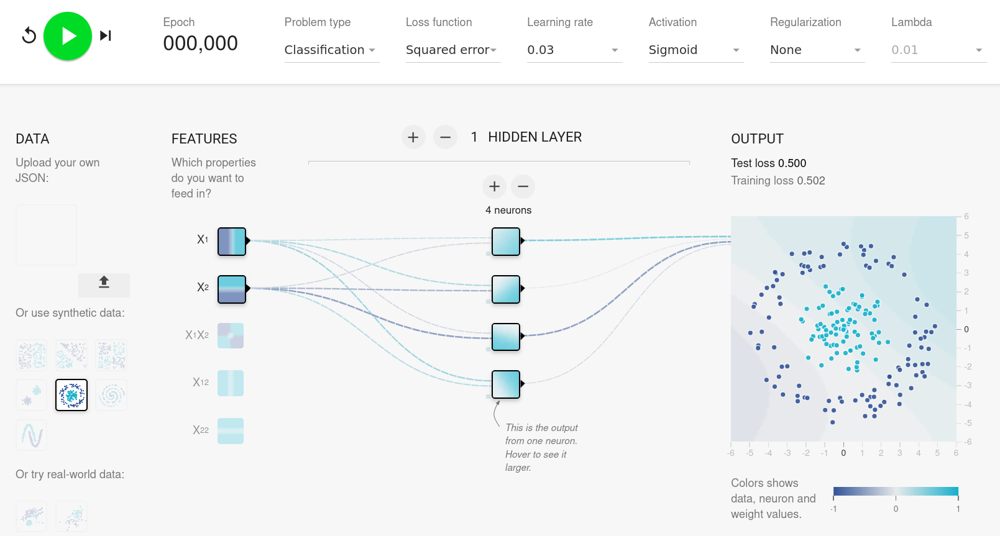
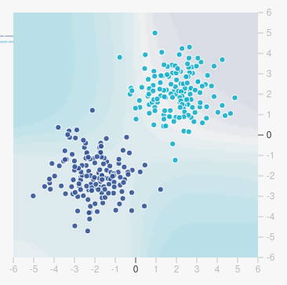
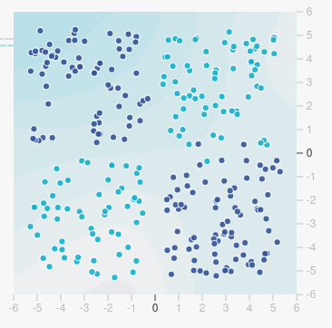
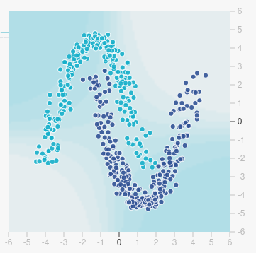
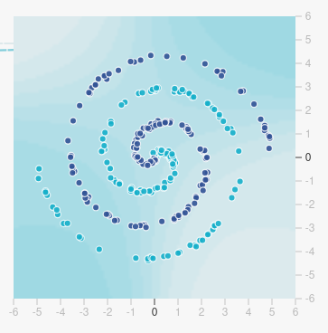

You should complete or follow the steps of the demo first to teach you the basics you need to know. If you are uncertain about how to proceed, go back to the [demo](../../demos/playground) and work through it again, or ask one of the lecturers for help.

For this activity, open up a web browser and visit [https://playground.scienxlab.org/](https://playground.scienxlab.org/). 




### 1. Gaussian

Select the "Gaussian" data. This is data arranged according to a gaussian or normal distribution, also called a bell-curve. This looks like a noisy blob. The data comes from two different gaussian distributions, so we have two blobs. We want our network to identify which points belong to which blob.

#### Task:

1. What is the simplest network that can classify this data? Use the interactive neural network to help you work this out.

<ShowAnswer>0 hidden layers. Where there is low noise, only one feature is required (e.g. X_1), but if noise increases both X_1 and X_2 features are needed. Greater noise will lead to worse accuracy, and it is not possible to make a network that avoids this.</ShowAnswer>

#### Aside: Gaussian Distributions

Lots of types of real-world data, spanning all the natural sciences, follow a bell-curve or gaussian distribution due to a mathematical law called the Central Limit Theorem.

#### !

**Challenge Question:** Theoretically would it be possible to create a network that classifies very noisy data with high accuracy?

---

Gaussian data is generated from a normal distribution or bell curve

><Column>

1. Select **Gaussian** data in Tensorflow Playground
2. What is the simplest network that classifies this data?

><Column>



></>

### 2. XOR

Select the XOR data. This is an example problem which cannot be separated by a straight line, which is a hint that you will need at least one hidden layer to solve it!

#### Task: 

1. Train a network that can classify this data with a low training loss (error). What is the lowest training loss you observe?

#### Task:

2. What is the _simplest_ network you can create that has a training loss less than 0.08?

<ShowAnswer>1 hidden layer, 3 neurons. A little bit of luck is required here, as the network may get caught in a local minima. Restarting training may be required.</ShowAnswer>

#### Task:

3. What is the _simplest_ network you can create that has a training loss less than 0.005?

<ShowAnswer> 2 hidden layers with 2 neurons each. However I had to restart the training many times because it frequently got caught in a local minima.</ShowAnswer>

#### Aside: Getting stuck. 

You will notice that sometimes the neural network stops learning but has not found a very good solution. Sometimes this is because no better solution is possible. However, it is often because the network has become caught in a _local minima_. In other words, all similar solutions it attempts are worse than its current solution.

---

XOR is an example of a problem that cannot be solved linearly

><Column>

1. Select **XOR** data in Tensorflow Playground

<KeyPoint>Different networks can achieve different training loss (error); we want networks with high accuracy (low error)</KeyPoint>

2. What is the simplest network that achieves a training loss of less than 0.08, and 0.005?

><Column>



></>


### 3. Moons

Select the "Moons" data.

#### Task: 

1. Train the the simplest network you can that can classify this data. For an extra challenge, try to reason about what the theoretically smallest network that can solve this problem would be.

<ShowAnswer>2 hidden layers of 2 neurons using inputs X1, X2. We know we should be able to achieve this with 2 neurons per layer, because we can visually see that it can be solved in 2 dimensions: a single curving line can separate the data. We see that the line needs to curve twice (or curve back on itself), which requires at least two hidden layers.</ShowAnswer>

---

><Column>

1. Select **Moons** data in Tensorflow Playground

<KeyPoint>Hidden layers let the network transform the data</KeyPoint>

2. What is the smallest network that can solve this problem?

><Column>



></>

### 4. Spiral

Select the "Spiral" data. This might take some training time because as you might be able to work out, it will require a larger network. Your goal is to train a network to classify this data. You can try out or combine two strategies:

1. Go deep (more hidden layers). We just need a very curvy curved line. Theoretically we need two dimensions and a very complex transformation. However, can a deep network with two neurons in each hidden layer learn this?

2. Go wide (more neurons per layer). Is it easier to represent this pattern in a higher dimensional space?


#### Task: 

Which strategy seems to be the most helpful? What problems do you encounter training the network?

---

><Column>

1. Select **Spiral** data in Tensorflow Playground

<KeyPoint>More neurons per layer enables a higher-dimensional representation</KeyPoint>

2. Explore different strategies (deep network vs. wide network) for solving this problem

><Column>



></>

### Conclusion: Real World Applications

Real-world data is complex and highly dimensional. There are lots of different properties about the world that we can measure. This data is not random, however. It obeys complex patterns. 

As humans, we know that by understanding the patterns of events around us, we are more able to make intelligent decisions. Neural networks learn to simplify these patterns to make decisions that appear intelligent, purely through the power of mathematics (and enough data).

We have seen how to train neural networks that recognise simple patterns. The networks we have trained are tiny, but the same principles scale up - more data and more computation enables more complex patterns.

Some patterns seem so complicated that we cannot imagine a machine ever learning them. For example, learning the patterns of human communication. So, when a computer talks to us - as large language models (LLMs) are now able to do - part of us readily believes it must really be _thinking_.

In fact, consider that LLMs are neural networks with _billions_ of parameters (and an enormous carbon footprint in terms of energy consumption). They are trained on _trillions_ of words of text - almost all the text ever produced by the human race. With such astronomical amounts of data, neural networks get _really good_ at predicting the patterns in human communication, but that is all they are doing.

So are AIs intelligent? That depends whether structure - relationships between data points, patterns - is sufficient for intelligence, or whether intelligence involves something more. This remains an open question.

>“The question of whether a computer can think is no more interesting than the question of whether a submarine can swim.” - Edsger W. Dijkstra


## Extensions

Interested and want to learn more? Some of these activities require more knowledge or experience.

#### Further Reading

Michael Nielsen, 2019. [Neural Networks and Deep Learning](http://neuralnetworksanddeeplearning.com/index.html)

This activity and how it explains neural networks was inspired by Chris Olah's (2014) paper on [Neural Networks, Manifolds, and Topology](http://colah.github.io/posts/2014-03-NN-Manifolds-Topology/).

---

### Key Concepts

This section describes some of the key concepts that are involved in training the neural network.

**Epoch** - The humber of times the training has cycled through the entire data set.

**Problem Type** - We have been discussing classification problems, where the goal is to draw a line between the two sets of data, allowing us to identify to which category a data point belongs. Another type of problem is a regression problem, this is where the network returns a number, not a category.

**Loss function** - This is the mathematical function used to calculate the error of the network. It is used when comparing the network's prediction with the true value of a data point. The network tries to minimise this error during the training process.

**Learning Rate** - When the network learns, it calculate the 'direction' it needs to move in and then takes a step. The learning rate is the size of that step. A small learning rate means smaller steps, and slower learning. A large learning rate means that the network can jump 'too far', going past the better solution to a worse one.

**Activation** - This is one of the mathematical functions calculated by each neuron. It is part of the process of transforming the input data to the neuron to produce its output.

**Regularisation** - These are methods to penalise complex models, which are at risk of over-fitting the training data. L1 and L2 regularisation add penalties to the cost function for the complexity of the model. The more complex the model becomes, the higher the cost (loss, or error). The network is therefore also trying to optimise for a simpler model. Simpler models are more likely to generalise to unseen data.

**Lambda** - A parameter for controlling the strength of the regularisation.

**Train:Test ratio** - The data set is split up into training data and test data. The network is trained on the training data. The test data is used to evaluate the network but does not affect its training.

**Noise** - In the provided data sets, the noise parameter controls how much randomness there is added to the data. Noisier data is typically harder to accurately classify, and the training loss will be higher.

**Batch size** - This many data points are used in training between each update of the weights of the network. If batch size is 1, the network is updated after each training example. Batching data avoids slowing down training.

### Train on your own data

The version of Tensorflow Playground used above allows you to upload your own data sets. This could be any data you are interested in and want to see what a neural network can learn from it.

This data needs to be in a JSON file format. Each dot represents data with an X and a Y value. Each data point is loaded from a JSON file in the format:

```json
{"x":0.8028169014,"y":0.5919661734,"label":1}
```

For a classification task like we have been performing above, the label should be either 1 or -1; the x and y values should ideally be between `[-1, 1]` (though these are normalised automatically if you forget). Because of the limitations of this tool, you can only have up to two input variables, called `x` and `y`.

You can use a tool such as [this one](https://jsonlint.com/csv-to-json) to convert a CSV file, saved from a spreadsheet package such as Excel, to JSON. The CSV should be in a format like this (a few hundred records is ideal):

| x | y | label |
| - | - | ----- |
| 0.8028169014 | 0.5919661734| 1     |

Convert your own data into the correct JSON format and then upload to Tensorflow Playground to train a neural network on it.

---

### Use your neural network

You can use Python to create a program that includes your neural network. Tensorflow Playground shows you the Python function to evaluate the trained network.

```python
import math
import tensorflow

def forward(X1, X2):
    """Compute a forward pass of the network."""
    a1 = math.tanh(0.10 + (0.35 * X1) + (-0.38 * X2))
    return a1

forward(0.5, 0.2)
```

To run this function, you need to import the `math` and `tensorflow` packages. Then call this function, passing the values for the X1 (x) and X2 (y) arguments.

You will need to first install the tensorflow package using

```bash
pip install tensorflow
```

---